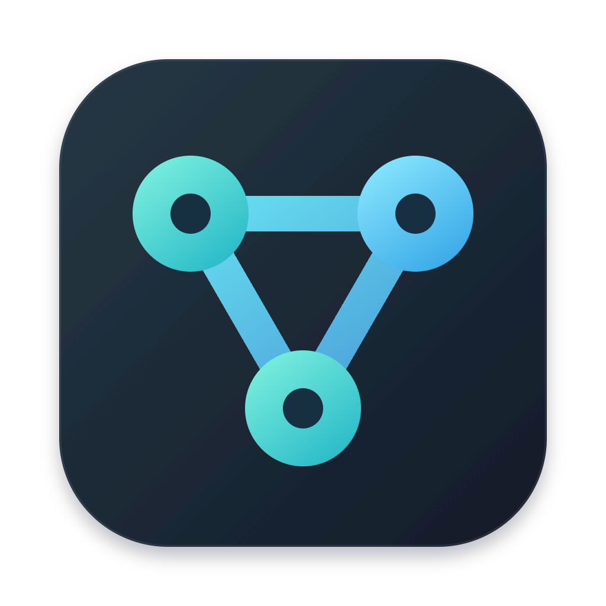

<p align="center">
  
</p>

# Relay

**在 Mac 上，让 Codex、Antigravity 和 Claude Code 共同完成一个需求。**

Relay 是本机运行的多 Agent 协作桌面 App。选择 Git 项目与成员，描述目标；团队自行规划、分工、沟通、验证、交叉评审和汇总，代码成果经检查后回写项目。

[下载 0.1.3 开发预览版](https://github.com/MingWangD/Relay/releases/tag/v0.1.3) · [使用指南](docs/USAGE.md) · [文档](docs/README.md) · [参与贡献](CONTRIBUTING.md) · [反馈问题](https://github.com/MingWangD/Relay/issues)

 [](https://github.com/MingWangD/Relay/releases/tag/v0.1.3) [](LICENSE)

## 为什么使用 Relay

- **一个需求，多名成员。** 混合三类 CLI，团队自动协商；不必手动分配角色或填写任务表单。
- **对话可以接续。** 每个聊天保留成员原生会话身份，后续需求继续使用同一组成员。
- **过程可检查。** 按需展开成员交流、任务和真实 CLI 终端；最终结论与文件改动单独呈现。
- **保留项目现状。** 从当前磁盘建立快照，在独立工作区执行、检查与评审；回写检测冲突，保留原项目 HEAD、分支与暂存区。
- **原生 Mac 体验。** AppKit 窗口、系统文件夹选择器、菜单和快捷键；App 内置 Node，用户无需另装 Node。

## 下载与安装

当前版本：**0.1.3 / build 4，开发预览版**。仅支持 **Apple Silicon（arm64）、macOS 13.5+**。

| 文件                                                                                                                   | 用途                                           |
| ---------------------------------------------------------------------------------------------------------------------- | ---------------------------------------------- |
| [Relay-0.1.3-macos-arm64.dmg](https://github.com/MingWangD/Relay/releases/download/v0.1.3/Relay-0.1.3-macos-arm64.dmg) | 推荐安装方式，打开后将 Relay 拖入 Applications |
| [Relay-0.1.3-macos-arm64.zip](https://github.com/MingWangD/Relay/releases/download/v0.1.3/Relay-0.1.3-macos-arm64.zip) | 解压得到 Relay.app，移动到 Applications        |
| [SHA256SUMS.txt](https://github.com/MingWangD/Relay/releases/download/v0.1.3/SHA256SUMS.txt)                           | 检查两个安装文件的完整性                       |

> 此版本采用 ad-hoc 签名，未经 Apple 公证，自动更新关闭。首次打开可能被 macOS 拦截。确认来源与校验值后，按 [Apple 官方说明](https://support.apple.com/en-us/102445) 对单个可信 App 进行授权。请保留系统全局安全保护。

安装前准备 Git，以及至少一个已安装、登录或配置服务的 CLI：`codex`、`agy`、`claude`。使用哪类成员，就需要对应 CLI。Relay 不提供模型账号；提交需求后可能产生厂商模型费用。详细步骤见 [安装指南](docs/INSTALLATION.md)。

## 开始第一次协作

1. 启动 Relay，用项目旁的“＋”选择可信的 Git 项目；首次建议使用已有提交的测试项目。
2. 配置 1–8 名成员，选择模型、思考强度和团队权限。选择项目、保存团队不会启动模型。
3. 输入需求，按 Enter 发送；Shift + Enter 换行。团队自动规划与执行。
4. 展开“查看协作过程”，查看交流、任务和真实终端；完成后阅读“最终结论”与“查看改动”。

例如：

> 审查项目的启动流程，说明关键文件、已有测试和两个未覆盖风险。自行分工并交叉检查，只分析，不修改文件；未运行的测试不要写成通过。

暂停、审批、恢复、项目切换和数据导入见 [使用指南](docs/USAGE.md)；模型缺失或连接失败见 [排障指南](docs/TROUBLESHOOTING.md)。

## 权限与数据

**新团队默认“完全访问”**：Agent 可读写当前用户能访问的文件、执行命令和联网，范围包含项目外文件。需要逐项确认时，请在发送需求前选择“原生审批”。这些设置只作用于 Relay 子进程，不修改 CLI 全局账号或权限。

独立工作区和回写检查用于保护项目成果，不能强制限制 Agent 对其他目录的操作；分析需求依赖文件审计，不是强制只读沙箱。只使用可信项目和模型配置。

App 数据存于 `~/Library/Application Support/Relay`；源码开发默认使用仓库内 `.local/`。首次启动不会自动导入其他数据。删除 Relay.app 不会删除聊天数据。数据导入由用户在原生菜单明确触发并先备份。详见 [数据与权限](docs/USAGE.md#数据与权限) 和 [安全说明](SECURITY.md)。

## 从源码运行

开发需要 Apple Silicon Mac、Node.js 24+ 和 Git；构建原生 App 还需要 Apple Command Line Tools。浏览器回归使用本机 Google Chrome。

```bash
git clone https://github.com/MingWangD/Relay.git
cd Relay
npm ci
npm run doctor
npm run build
npm start
```

打开服务输出的完整本机链接，保留 `#token=` 部分；不要分享此链接。`doctor` 检查 CLI 安装与接口能力，不证明登录或模型调用成功。

构建原生 App：`npm run macos:build`。开发、测试与打包说明见 [开发指南](docs/DEVELOPMENT.md)、[测试指南](docs/TESTING.md) 和 [发布流程](docs/RELEASING.md)。

## 当前状态

已发布可下载的开发预览版；自动检查及隔离项目内的三类 CLI 协作已完成。实际验收机器为 macOS 26.4。**macOS 13.5 实机、干净机器、默认 Gatekeeper 首次授权、Dock／应用切换器与最小化恢复仍待验收。** Developer ID、公证和生产自动更新尚未完成。

模型支持取决于本机 CLI、账号和服务配置；历史成功的模型 ID 不保证当前可用。Git 子模块、跨服务重新附着旧 PTY 和公网协作暂不支持。完整事实见 [验收摘要](docs/VALIDATION.md)，版本变化见 [发布说明](docs/RELEASE_NOTES.md)。

## 文档与贡献

- 使用者：[安装](docs/INSTALLATION.md) · [使用](docs/USAGE.md) · [排障](docs/TROUBLESHOOTING.md)
- 开发者：[贡献指南](CONTRIBUTING.md) · [架构](docs/ARCHITECTURE.md) · [开发](docs/DEVELOPMENT.md) · [测试](docs/TESTING.md)
- Agent：[AGENTS.md](AGENTS.md) · [交接入口](HANDOFF.md)
- 维护者：[发布流程](docs/RELEASING.md) · [验收事实](docs/VALIDATION.md)

欢迎提交可复现的问题、小范围修复和文档改进。功能建议请说明具体使用场景；涉及凭据、越权或数据泄露的报告使用 [私密漏洞入口](SECURITY.md#报告漏洞)。

## 许可证

源码与原创图标采用 [MIT](LICENSE)，版权署名 MingWangD。分发的 Node、Sparkle 和生产依赖保留各自许可证，见 [第三方声明](THIRD_PARTY_NOTICES.md)。
