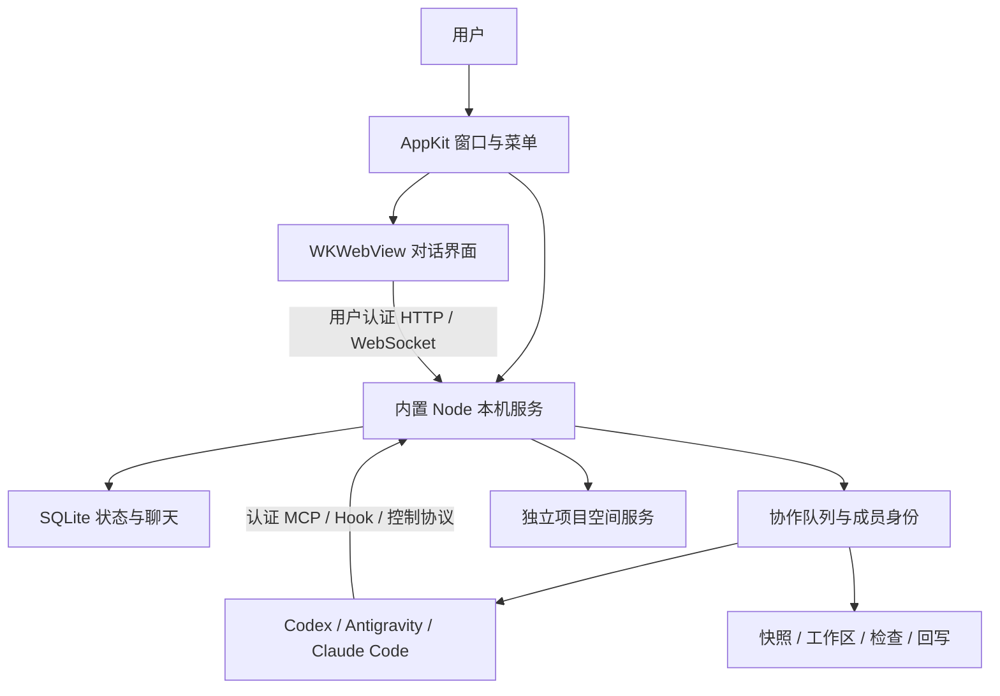

# Relay 架构

Relay 是 macOS 本机、单用户、每个项目空间绑定一个 Git 项目的协作控制台。界面不直接调用模型，原生壳不承担任务调度。

## 进程与接口

AppKit 负责生命周期、菜单、文件夹选择、数据导入、窗口状态和内置 Node。服务通过随机 loopback 端口及私有 ready 文件握手；退出 App 停止服务与 PTY。WKWebView 只允许主服务授权的 Relay origin，外部链接交系统浏览器。

TypeScript 服务负责队列、权限、身份、真实 CLI、持久化和成果处理。浏览器开发入口沿用同一服务，使用当前带 token 链接。认证 token 不写日志或公开文档。

## 项目、聊天与身份

`local-projects.ts` 为不同 Git 根目录建立独立控制台、数据库与凭据；主服务拥有子空间生命周期。选择项目只绑定空间，不启动模型。

每个聊天拥有独立成员与设置，同一项目共享串行需求队列。成员原生 ID 和启动目录固定，全阶段及后续需求接续；进程可重启、凭据可轮换，身份不替换。恢复失败进入显式处理，不改用最近会话或 fork。

任务与投递状态由 SQLite 中的结构化事件及服务协议确认。终端文字、动画和一次工具活动不能代替完成状态。客户端保留阅读与焦点，不因状态广播重建成员或自动滚动。

## 三类 CLI

- Codex：真实 PTY TUI 连接受认证本机 App Server，thread／turn 协议控制明确会话。
- Antigravity：`agy` PTY、token-free 本地 MCP 插件及生命周期 Hook；空闲消息在确认旧进程退出后接续明确 conversation ID。
- Claude Code：真实 PTY、单次 MCP／settings 与生命周期／工具 Hook，使用明确 ID resume。模型目录与实际启动共享有超时的登录 shell 环境解析。

Relay 继承本机 CLI 账号／服务配置，只控制对应子进程。原生登录、风险确认、系统权限与组织规则保持人工入口。具体模块见 [AGENTS](../AGENTS.md)。

## 成果处理

需求开始时，从当前磁盘生成私有快照，包含已有未提交和未忽略文件。平台使用独立 Git 索引与 worktree，保留原项目 HEAD、分支和暂存区。

代码任务形成候选成果，经过平台独立检查、非作者评审和候选整合再回写。单成员情况说明无交叉评审；无自动测试入口说明未执行自动测试。回写核对原状态和相关路径，遇人工修改或冲突暂停；失败按日志撤回本次写入，遇撤回期间人工修改则停止并保留备份。

分析任务只提交报告与依据，以文件审计验收，不生成虚构代码提交。权限为完全访问时，工作区不能强制阻止项目外文件操作；项目检查脚本也不是恶意代码沙箱。

## 原生数据与发布

App 默认数据位于 `~/Library/Application Support/Relay`；开发默认 `.local/`。导入由用户明确触发，校验源服务锁与目录边界，备份目标后复制，失败回滚；源数据保持。

当前 App 嵌入官方 Node arm64 与 Sparkle 2；开发预览版 ad-hoc 签名、未公证、生产更新关闭。正式 Developer ID、公证和签名 appcast 是后续发布条件，不能由源码构建成功推导。构建细节见 [macOS](../macos/README.md)，测试事实见 [VALIDATION](VALIDATION.md)。
